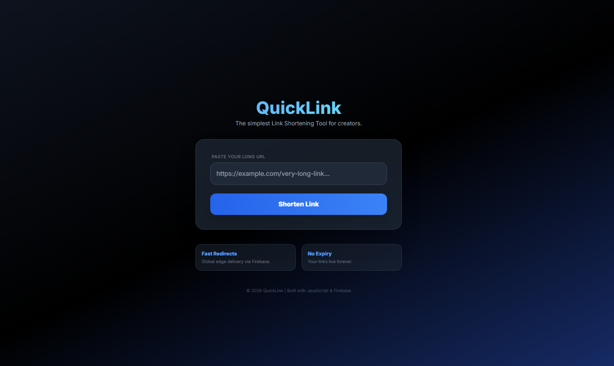

# 🔗 QuickLink - Modern URL Shortener
<p align="center">
  
</p>

QuickLink is a lightweight, high-performance link shortening tool designed for speed and simplicity. Built as a serverless application, it leverages **Firebase Firestore** for real-time data management and **GitHub Actions** for automated deployment.


## 🚀 Live Demo
Check out the live app here: [q9linkshortner.web.app](https://q9linkshortner.web.app)

## ✨ Features
- **Fast Redirects:** Uses Firebase Firestore for sub-second link resolution.
- **Glassmorphism UI:** Modern, responsive design built with **Tailwind CSS**.
- **SEO Optimized:** Meta tags and Open Graph support for high search visibility and professional social sharing.
- **Lazy Deletion:** Automated database maintenance that removes links older than 30 days without needing a paid backend.
- **CI/CD Pipeline:** Fully automated deployments via GitHub Actions.

## 🛠️ Tech Stack
- **Frontend:** HTML5, JavaScript (ES6+), Tailwind CSS (via CDN)
- **Database:** Firebase Firestore (NoSQL)
- **Hosting:** Firebase Hosting
- **Automation:** GitHub Actions (CI/CD)

## 📂 Project Structure
```text
├── .github/workflows/    # CI/CD Deployment scripts
├── public/
│   ├── index.html        # Main Application (UI + Logic)
│   └── ...               # Assets (Favicons, etc.)
├── firestore.rules       # Database Security Rules
├── firestore.indexes.json # Firestore query optimizations
└── firebase.json         # Firebase configuration
